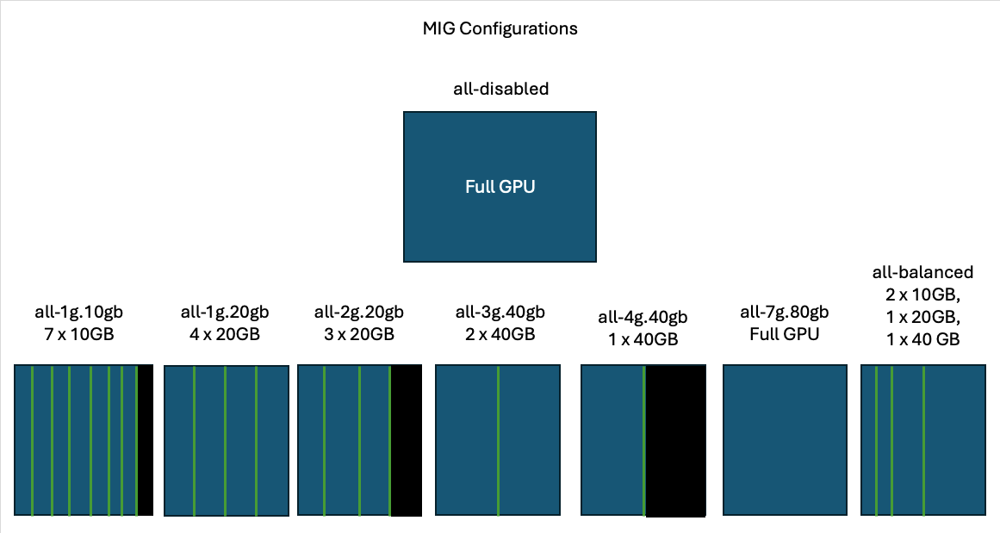

# Multi-Instance GPU (MIG)

[Jump to Quickstart](#quickstart)

## What is it?

Multi-Instance GPU (MIG) is a feature of NVIDIA GPUs that allows a single physical GPU to be partitioned into multiple isolated instances, each acting as an independent GPU with dedicated compute, memory, and cache resources. This enables multiple users or workloads to run concurrently on a single GPU without interfering with each other without virtualization overhead - so no performance penalty.

## When to use it?

Use MIG when you need to efficiently share GPU resources among multiple inference workloads or users. MIG is particularly useful when running multiple smaller models that do not require an entire GPU. For example, if you're hosting multiple smaller LLMs (such as Llama-7B, Mistral-7B, or Gemma-2B) on an A100 or H100 GPU, MIG ensures resource allocation is optimized, preventing one model from monopolizing the entire GPU while still maintaining high throughput. In this scenario, it is incredibly well-suited for [autoscaling](../auto_scaling/README.md), because many more pods can be scheduled onto a single node depending on the MIG configuration.

As a more concrete example, we will use the scenario of inference serving with Llama-3.1-8B-Instruct. Llama-3.1-8B-Instruct takes roughly `8B * 2 = 16GB` of GPU memory. This would only use about 1/5 of the memory in an H100.

Without MIG, a full H100 GPU would be needed to serve this model as the GPU cannot execute separate processes simultaneously on a single GPU, wasting ~64GB of the GPU memory. With MIG, we can use the configuration **all-1g.20gb** described below in [Mig Configurations](#mig-configurations) to serve 4 of these models on a single H100 GPU.

For small models like this, we would see a moderate drop in performance of a single slice (10-20%), but a huge gain in aggregate performance (~300%) across the 4 instances, which could all be served as a single blueprint.

## Support and Configurations

Currently, AI/ML Toolkit only supports MIG for **H100 GPUs**, or the OCI shape **BM.GPU.H100.8**. When a MIG configuration (explained below) is applied, it is applied to all H100s on the node, so a single BM.GPU.H100.8 has 8 H100 GPUs on it and applying a MIG configuration would apply it to all 8 GPUs.

Additionally, using multiple "slices" for a single workload is not supported, so MIG is best when the entire task can be incorporated into a single slice. As an example of what this is referring to, when serving LLM inference in a standard (non-MIG) blueprint, it is possible to use multiple GPUs with tensor-parallelism to distribute a model over those GPUs.

This is not supported with MIG because this is not supported by NVIDIA NCCL. Instead, it is recommended to use a larger slice or full GPUs if more performance or tensor-parallelism is needed.

### Mig Configurations

The following table provides MIG configurations supported by AI/ML Toolkit:

| Configuration | Total Slices Per GPU | Total Memory Per Slice | Total Compute Fraction | Pods Schedulable |                     Description                      |
| :-----------: | :------------------: | :--------------------: | :--------------------: | :--------------: | :--------------------------------------------------: |
|  all-1g.10gb  |          7           |          10GB          |          1/7           |        7         |    7 mini GPUs with 10GB each with 14% of compute    |
|  all-1g.20gb  |          4           |          20GB          |          1/4           |        4         |    4 mini GPUs with 20GB each with 25% of compute    |
|  all-2g.20gb  |          3           |          20GB          |          2/7           |        3         |    3 mini GPUs with 20GB each with 29% of compute    |
|  all-3g.40gb  |          2           |          40GB          |          3/7           |        2         |    2 mini GPUs with 40GB each with 43% of compute    |
|  all-4g.40gb  |          1           |          40GB          |          4/7           |        1         |       1 mini GPU with 40GB with 57% of compute       |
|  all-7g.80gb  |          1           |          80GB          |          7/7           |        1         |                    Full H100 GPU                     |
| all-balanced  |          4           | 2x10GB, 1x20GB, 1x40GB |          7/7           |        4         | 2 of the profile 1g.10gb, 1 2g.20gb, 1 3g.40gb above |
| all-disabled  |          -           |           -            |           -            |        -         |            Turn MIG off and use full H100            |

For a visual representation of slicing (black represents unusable GPU in that configuration):

### How to choose MIG configuration for a given model?

1. Find the number of parameters in your model (usually in the name of the model such as Llama-3.2-3B-Instruct would have 3 billion parameters)
2. Determine the precision of the model (FP32 vs FP16 vs FP8) - you can find this in the config.json of the model if on hugging face (look for the torch_dtype); a good assumption is that the model was trained on FP32 and is served on FP16 so FP16 is what you would use for your model precision
3. Use formula here: https://ksingh7.medium.com/calculate-how-much-gpu-memory-you-need-to-serve-any-llm-67301a844f21 or https://www.substratus.ai/blog/calculating-gpu-memory-for-llm to determine the amount of GPU memory needed, so in this case `((3GB * 4) / (32 / 16)) * 1.2 ~= 7.2GB`
4. Determine which MIG configuration above meets your needs. In this case, `all-1g.10gb` is appropriate because it has 10GB of memory per slice.
5. With `all-1g.10gb`, you could serve `7 Slices per GPU * 8 GPUs = 56` instances of this model on a single `BM.GPU.H100.8`. Optionally using `all-balanced`, you could serve `2 Slices per GPU * 8 GPUs = 16` instances of this model, and have 8 instances of a 20GB GPU, and 8 instances of a 40GB GPU for other workloads.

## Required Blueprint Parameters

There are two ways to apply a mig configuration to a node pool.

1. During shared_node_pool deployment
2. As an update to an existing shared node pool

### Mig Blueprint Configuration

#### shared_node_pool:

Apart from the existing requirements for a shared node pool found [here](../shared_node_pools/README.md), the following are additional requirements / options for MIG:

- `"shared_node_pool_mig_config"` - the mig congfiguration to apply to each node in the node pool. Possible values are in the [Mig Configurations](#mig-configurations). This will apply the node to each node in the pool, but if you want to update a specific node that can be done via the `update` mode described in the next section.
- `"recipe_max_pods_per_node"`: [OPTIONAL: DEFAULT = 90] - by default, since MIG can slice up to 56 times for a full BM.GPU.H100.8, the default 31 pods by OKE is insufficient. As part of shared_node_pool deployment for MIG, this value is increased to 90 to fit all slice configurations + some buffer room. The maximum value is proportedly 110. It is not recommended to change this value, as it can not be modified after deployment of a pool. In order to change it, a node must be removed from the pool and re-added with the new value.

A sample blueprint for the mig enabled shared pool can be found [in sample blueprints](../sample_blueprints/mig_enabled_shared_node_pool.json).

#### update mig configuration:

Alternatively, you can update the MIG configuration of an existing node pool as a separate deployment. This is useful if you want to update the MIG configuration of a specific node, or if you want to change the MIG configuration of a pool. Updates to mig configuration typically take 1-2 minutes but can take up to 5 if applying MIG to a previously unmigged node.

Importantly, when applying the MIG configuration update, nothing should be running on the node being updated. This is because MIG is making changes at the hardware level which will affect running applications. Alternatively, the MIG configuration may fail if the node is currently running a workload.

In future iterations, we will add support to temporarily pause work and reschedule work onto the node, but that is not yet supported.

- `"recipe_mode"`: `"update"` - this specifies that you want to update the MIG configuration of an existing node pool.
- `"deployment_name"` - Any name you want to assign the update deployment. This is a new name that you can use to reference the update deployment.
- `"shared_node_pool_mig_config"` - the mig configuration to apply to each node in the node pool. Possible values are in the [Mig Configurations](#mig-configurations). With the update entrypoint, this can be applied to a specific node, or the whole node pool.
- `"recipe_node_name"` - One of `"recipe_node_name"` or `"recipe_node_pool_name"` must be provided - this is the private IP address of the node. This will only apply the passed mig configuration to the specified node, rather than the whole pool. This option currently only supports a single node at a time.
- `"recipe_node_pool_name"` - One of `"recipe_node_name"` or `"recipe_node_pool_name"` must be provided - this is the name of the node pool. This will apply the passed mig configuration to the whole pool, rather than a specific node.

A sample blueprint to update using **node name**: [mig_update_shared_pool_with_node_name.json](../sample_blueprints/mig_update_node_with_node_name.json).

A sample blueprint to update using **node pool name**: [mig_update_shared_pool_with_node_pool_name.json](../sample_blueprints/mig_update_shared_pool_with_node_pool_name.json).

### Use MIG Resource in Blueprint

#### Resource requests:

There is one way to request MIG resources during deployment of a blueprint. It is only valid to request a MIG resource if the node has been pre-configured with that MIG configuration prior to blueprint deployment. If a blueprint requests a MIG resource that has not been configured on any node, the blueprint will fail validation. The parameter:

- `"mig_resource_request"` - the type of MIG resource the blueprint should run on.

The list of available MIG resource requests:

| Resource |                                Description                                |
| :------: | :-----------------------------------------------------------------------: |
| 1g.10gb  |          Request a 10GB slice (from all-1g.10gb or all-balanced)          |
| 1g.20gb  |               Request a 20GB slice (from all-1g.20gb only)                |
| 2g.20gb  | Request a 20GB slice with more compute (from all-2g.20gb or all-balanced) |
| 3g.40gb  |          Request a 40GB slice (from all-3g.40gb or all-balanced)          |
| 4g.40gb  |      Request a 40GB slice with more compute (from all-4g.40gb only)       |
| 7g.80gb  |          Request 80GB with full compute (from all-7g.80gb only)           |

**Note**: 7g.80gb is a MIG configuration - that means that if this configuration is in place, you must request this configuration to use the GPU. It is recommended to disable MIG with `all-disabled` if you intend to use the full compute.

If you would like to run the same blueprint across many slices (which may be the case with LLM inference), increase the number of replicas in `recipe_replica_count`.

A sample blueprint with multiple replicas can be found here: [mig_inference_multiple_replicas.json](../sample_blueprints/mig_inference_multiple_replicas.json).

A sample blueprint with a single replica can be found here: [mig_inference_single_replica.json](../sample_blueprints/mig_inference_single_replica.json).

## Quickstart

The following is a quickstart with the example flow of using MIG for blueprint deployment.

1. Approximate your model's resource requirements using the framework in the [How to choose MIG](#how-to-choose-mig-configuration-for-a-given-model) section.
2. Launch your H100 shared pool with the correct [MIG config](#mig-configurations) based on (1).
3. Launch your blueprint onto that MIG configuration with [Use MIG in a blueprint](#use-mig-resource-in-blueprint).
4. Evaluate usage. If more memory is needed, select a larger slice from the MIG configurations. If less memory / performance is needed and you can run more workloads, select a smaller slice, and [update MIG configuration](#update-mig-configuration).
5. Rerun your workflow and re-evaluate.
6. Repeat steps 3-5 until optimal setup is determined.

Executing the blueprints below would be an exact representation of the above.

1. Launch shared pool: [shared_mig_pool.json](../sample_blueprints/mig_enabled_shared_node_pool.json)
2. Launch MIG inference when pool is active: [mig_inference.json](../sample_blueprints/mig_inference_single_replica.json)
3. Evaluate performance and determine update is needed to reduce memory from 20gb slice to 10gb slice: [update_mig.json](../sample_blueprints/mig_update_node_with_node_name.json)
4. Launch recipe again, this time selecting 1g.10gb resource: [mig_inference.json](../sample_blueprints/mig_inference_single_replica_10gb.json)
